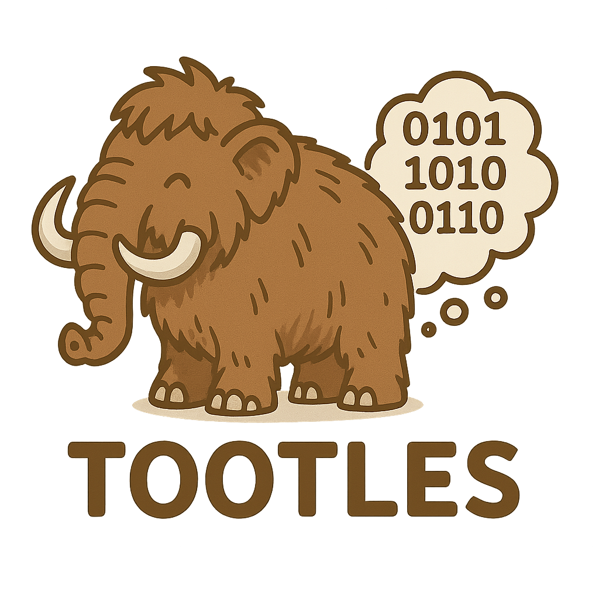

<div align="center"></div>

# Tootles Themes

A comprehensive collection of beautiful and customizable themes for the Tootles Mastodon client. Transform your social media experience with carefully crafted visual styles that enhance readability, accessibility, and aesthetic appeal.

## 🎨 Gallery

*Theme screenshots and previews will be added here as themes are developed.*

### Featured Themes
- **Default** - Clean and modern interface with balanced colors
- **Dark** - Easy on the eyes for low-light environments
- **Light** - Bright and airy design for daytime use
- **High Contrast** - Enhanced accessibility with improved visibility
- **Community Templates** - Base templates for creating custom themes

## 📦 Installation

### Prerequisites
- Tootles Mastodon client installed
- Access to theme configuration directory

### Install Themes

1. Clone this repository:
   ```bash
   git clone https://github.com/username/tootles-themes.git
   ```

2. Copy theme files to your Tootles themes directory:
   ```bash
   cp tootles-themes/themes/* ~/.config/tootles/themes/
   ```

3. Restart Tootles to load new themes

### Manual Installation

1. Download individual theme files from the `themes/` directory
2. Place them in your Tootles themes folder
3. Refresh the application

## 🚀 Usage

### Applying Themes

1. Open Tootles settings
2. Navigate to **Appearance** or **Themes** section
3. Select your desired theme from the dropdown menu
4. Click **Apply** to activate the theme

### Theme Switching

Themes can be switched at any time through the settings interface. Changes take effect immediately without requiring an application restart.

## 🎭 Available Themes

### Built-in Themes

| Theme Name | Description | Best For |
|------------|-------------|----------|
| **Default** | Standard Tootles appearance | General use |
| **Dark** | Dark mode with reduced eye strain | Night time, low-light environments |
| **Light** | Clean light theme | Bright environments, daytime use |
| **High Contrast** | Enhanced visibility and accessibility | Users with visual impairments |

### Community Themes

*Community-contributed themes will be listed here as they become available.*

## 🛠 Theme Development

### Theme Structure

Themes are CSS files that override the default Tootles styling:

```
themes/
├── theme-name.css
├── assets/
│   ├── icons/
│   └── images/
└── README.md
```

### Creating Custom Themes

1. Use `community-template.css` as a starting point
2. Modify CSS variables and selectors
3. Test thoroughly across different screen sizes
4. Follow accessibility guidelines
5. Submit via pull request

### CSS Variables

Key customizable variables:
- `--primary-color`: Main accent color
- `--background-color`: Main background
- `--text-color`: Primary text color
- `--border-color`: Border and separator color
- `--hover-color`: Interactive element hover state

## 🤝 Contributing

We welcome contributions from the community! Here's how you can help:

### Theme Contributions

1. Fork this repository
2. Create a new branch for your theme
3. Develop your theme following our guidelines
4. Test across different devices and accessibility tools
5. Submit a pull request with:
   - Theme file(s)
   - Screenshots
   - Description and usage notes

### Guidelines

- Follow CSS best practices
- Ensure accessibility compliance (WCAG 2.1 AA)
- Test on multiple screen sizes
- Provide clear documentation
- Use semantic naming conventions

### Bug Reports

Found an issue with a theme? Please open an issue with:
- Theme name and version
- Steps to reproduce
- Expected vs actual behavior
- Screenshots if applicable

## 📄 License

This project is licensed under the MIT License - see the [LICENSE](LICENSE) file for details.

## 📞 Support

- **Issues**: Report bugs and request features via GitHub Issues
- **Discussions**: Join community discussions in GitHub Discussions
- **Documentation**: Additional docs available in the `docs/` directory

## 🙏 Acknowledgments

- Tootles development team for the excellent Mastodon client
- Community contributors and theme creators
- Accessibility advocates for guidance and feedback

---

**Copyright Jascha Wanger 2025**

*Made with ❤️ for the Mastodon community*